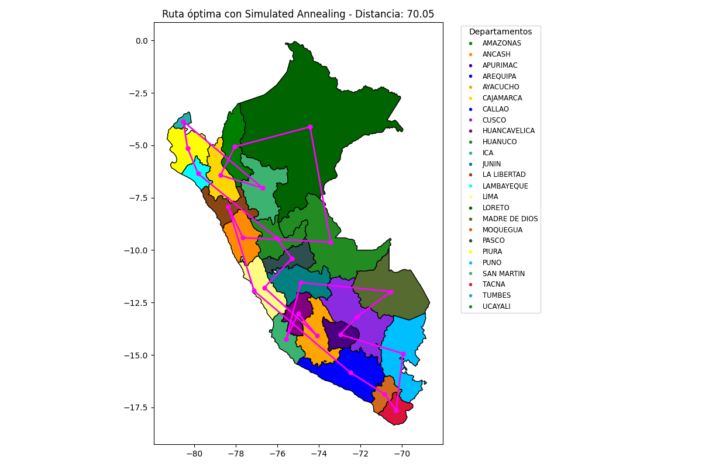

[](https://github.com/ShinjiMC/Simulated_Annealing_TSP/blob/main/LICENSE)

# Simulated Annealing Algorithm for TSP by Braulio Maldonado Casilla

@ShinjiMC - By Braulio Nayap Maldonado Casilla

The **Simulated Annealing (SA)** algorithm is a probabilistic technique used for finding an approximate solution to an optimization problem. Inspired by the process of annealing in metallurgy, it involves heating and then slowly cooling a material to vary its physical properties. In the context of optimization, simulated annealing helps to find a minimum or maximum by exploring the solution space in a way that mimics the physical process.

## Application to the Traveling Salesman Problem (TSP)

The Traveling Salesman Problem (TSP) is a classic algorithmic problem in the field of computer science and operations research. It focuses on optimization. In this problem, the task is to find the shortest possible route that visits a set of nodes exactly once and returns to the origin point.

For the TSP using the departments of Peru as nodes, the simulated annealing algorithm adjusts routes (permutations of nodes) in search of the route with the smallest total distance.

## Code Explanation

Here's an explanation of the main functions and parts of the provided code, formatted in Markdown for clarity.

### Import Statements

```markdown
import geopandas as gpd
import numpy as np
import matplotlib.pyplot as plt
import matplotlib.colors as mcolors
import random
import math
```

These lines import necessary libraries for handling geographical data, numerical operations, and plotting.

### Loading Geographical Data

```markdown
gdf = gpd.read_file('peru_departamental_simple.geojson')
centroids = gdf['geometry'].centroid
names = gdf['NOMBDEP']
coords = [(point.x, point.y) for point in centroids]
```

The code loads departmental data for Peru from a GeoJSON file using GeoPandas. It calculates the centroids of each department, which are used as nodes in the TSP.

#### Color Setup

```markdown
color = [(r / 255, g / 255, b / 255) for r, g, b in color]
gdf['color'] = color[:len(names)]
```

Each department is assigned a color for visualization purposes.

#### Distance Function

```markdown
def distance(idx1, idx2):
x1, y1 = coords[idx1]
x2, y2 = coords[idx2]
return np.sqrt((x2 - x1)**2 + (y2 - y1)**2)
```

Calculates the Euclidean distance between two nodes based on their coordinates.

#### Total Distance Function

```markdown
def total_distance(path):
return sum(distance(path[i], path[i+1]) for i in range(len(path) - 1)) + distance(path[-1], path[0])
```

Calculates the total distance of a route, looping back to the start to complete the circuit.

#### Simulated Annealing Function

```markdown
def simulated_annealing(nodes, temp=10000, cooling_rate=0.003): # Initialization and annealing process omitted for brevity
return best_path, best_cost
```

This function implements the simulated annealing algorithm. It starts with an initial path and iteratively makes small changes, accepting these new paths based on the difference in cost and the system temperature, which decreases with each iteration.

## Visualization

The visualization is handled using matplotlib, displaying the current state of the path throughout the annealing process, as well as the final optimal path.

```markdown
plt.title(f'Ruta óptima con Simulated Annealing - Distancia: {best_cost:.2f}')
```

The plot is titled with the final optimal path's distance prominently displayed.



## Conclusion

This code effectively demonstrates the application of the simulated annealing algorithm to solve the TSP for the geographical setup of Peru’s departments. By visualizing the progress and the results, it provides both an educational tool and a practical solution method.
