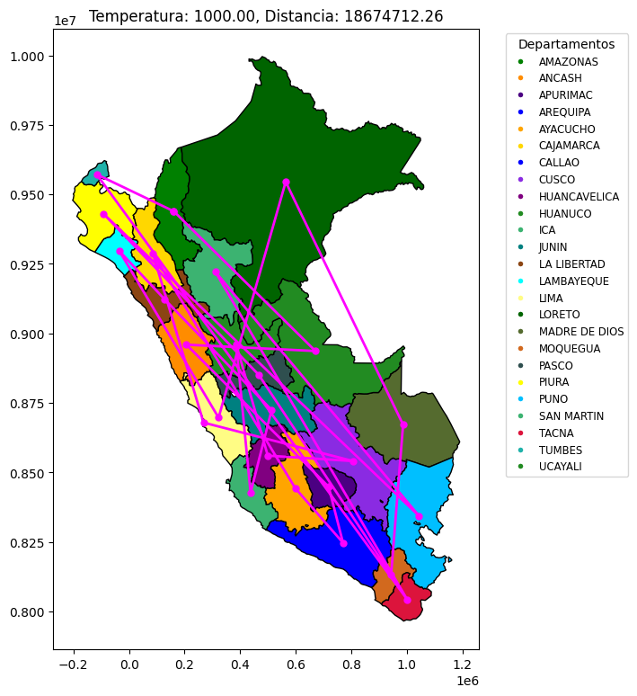
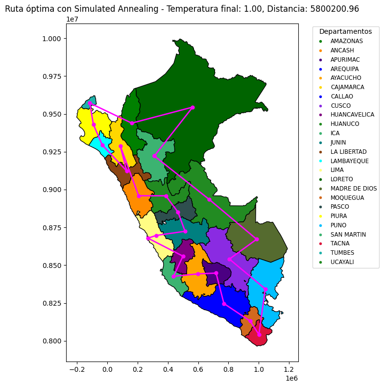
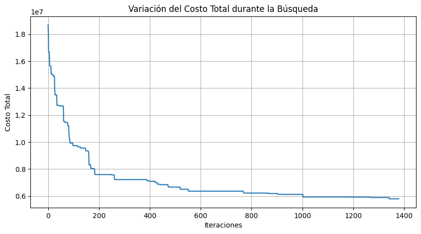
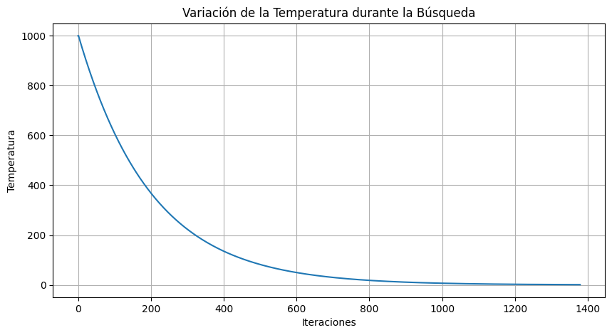

[](https://github.com/ShinjiMC/Simulated_Annealing_TSP/blob/main/LICENSE)

# Simulated Annealing Algorithm for TSP by Braulio Maldonado Casilla [ENG]

@ShinjiMC - By Braulio Nayap Maldonado Casilla

The **Simulated Annealing (SA)** algorithm is a probabilistic technique used for finding an approximate solution to an optimization problem. Inspired by the process of annealing in metallurgy, it involves heating and then slowly cooling a material to vary its physical properties. In the context of optimization, simulated annealing helps to find a minimum or maximum by exploring the solution space in a way that mimics the physical process.

## Application to the Traveling Salesman Problem (TSP)

The Traveling Salesman Problem (TSP) is a classic algorithmic problem in the field of computer science and operations research. It focuses on optimization. In this problem, the task is to find the shortest possible route that visits a set of nodes exactly once and returns to the origin point.

For the TSP using the departments of Peru as nodes, the simulated annealing algorithm adjusts routes (permutations of nodes) in search of the route with the smallest total distance.

## Code Explanation

Here's an explanation of the main functions and parts of the provided code, formatted in Markdown for clarity.

### Import Statements

```markdown
import geopandas as gpd
import numpy as np
import matplotlib.pyplot as plt
import matplotlib.colors as mcolors
import random
import math
```

These lines import necessary libraries for handling geographical data, numerical operations, and plotting.

### Loading Geographical Data

```markdown
gdf = gpd.read_file('peru_departamental_simple.geojson')
centroids = gdf['geometry'].centroid
names = gdf['NOMBDEP']
coords = [(point.x, point.y) for point in centroids]
```

The code loads departmental data for Peru from a GeoJSON file using GeoPandas. It calculates the centroids of each department, which are used as nodes in the TSP.

#### Color Setup

```markdown
color = [(r / 255, g / 255, b / 255) for r, g, b in color]
gdf['color'] = color[:len(names)]
```

Each department is assigned a color for visualization purposes.

#### Distance Function

```markdown
def distance(idx1, idx2):
x1, y1 = coords[idx1]
x2, y2 = coords[idx2]
return np.sqrt((x2 - x1)**2 + (y2 - y1)**2)
```

Calculates the Euclidean distance between two nodes based on their coordinates.

#### Total Distance Function

```markdown
def total_distance(path):
return sum(distance(path[i], path[i+1]) for i in range(len(path) - 1)) + distance(path[-1], path[0])
```

Calculates the total distance of a route, looping back to the start to complete the circuit.

#### Simulated Annealing Function

```markdown
def simulated_annealing(nodes, temp=10000, cooling_rate=0.003): # Initialization and annealing process omitted for brevity
return best_path, best_cost
```

This function implements the simulated annealing algorithm. It starts with an initial path and iteratively makes small changes, accepting these new paths based on the difference in cost and the system temperature, which decreases with each iteration.

## Visualization

The visualization is handled using matplotlib, displaying the current state of the route throughout the annealing process, as well as the final optimal path.

```markdown
plt.title(f'Optimal Route with Simulated Annealing - Distance: {best_cost:.2f}')
```

To run the code, first ensure you have the following dependencies or libraries installed:

- Geopandas
- Numpy
- Matplotlib

You can install these dependencies using pip:

```bash
pip install geopandas numpy matplotlib
```

Once the dependencies are installed, you can execute the `main.py` file as follows:

```bash
python main.py
```

This will execute the code and generate the visualization of the simulated annealing process to solve the Traveling Salesman Problem (TSP) using the departments of Peru as nodes.



The final optimal route will be displayed on the graph with the total distance prominently highlighted in the title.

The plot is titled with the prominently displayed distance of the final optimal route.



## Conclusion

This code effectively demonstrates the application of the simulated annealing algorithm to solve the TSP for the geographical setup of Peru’s departments. By visualizing the progress and the results, it provides both an educational tool and a practical solution method.

---

# Algoritmo de Recocido Simulado para el Problema del Viajero Comerciante (TSP) por Braulio Maldonado Casilla [ESP]

@ShinjiMC - Por Braulio Nayap Maldonado Casilla

El algoritmo de **Recocido Simulado (SA)** es una técnica probabilística utilizada para encontrar una solución aproximada a un problema de optimización. Inspirado en el proceso de recocido en metalurgia, implica calentar y luego enfriar lentamente un material para variar sus propiedades físicas. En el contexto de la optimización, el recocido simulado ayuda a encontrar un mínimo o máximo explorando el espacio de soluciones de una manera que imita el proceso físico.

## Aplicación al Problema del Viajero Comerciante (TSP)

El Problema del Viajero Comerciante (TSP) es un problema algorítmico clásico en el campo de la informática y la investigación de operaciones. Se centra en la optimización. En este problema, la tarea es encontrar la ruta más corta posible que visite un conjunto de nodos exactamente una vez y regrese al punto de origen.

Para el TSP utilizando los departamentos del Perú como nodos, el algoritmo de recocido simulado ajusta las rutas (permutaciones de nodos) en busca de la ruta con la menor distancia total.

## Explicación del Código

Aquí hay una explicación de las funciones principales y partes del código proporcionado, formateado en Markdown para mayor claridad.

### Declaraciones de Importación

```markdown
import geopandas as gpd
import numpy as np
import matplotlib.pyplot as plt
import matplotlib.colors as mcolors
import random
import math
```

Estas líneas importan las bibliotecas necesarias para manejar datos geográficos, operaciones numéricas y visualización.

### Carga de Datos Geográficos

```markdown
gdf = gpd.read_file('peru_departamental_simple.geojson')
centroids = gdf['geometry'].centroid
names = gdf['NOMBDEP']
coords = [(point.x, point.y) for point in centroids]
```

El código carga datos departamentales para Perú desde un archivo GeoJSON usando GeoPandas. Calcula los centroides de cada departamento, que se utilizan como nodos en el TSP.

### Configuración de Colores

```markdown
color = [(r / 255, g / 255, b / 255) for r, g, b in color]
gdf['color'] = color[:len(names)]
```

A cada departamento se le asigna un color con fines de visualización.

### Función de Distancia

```markdown
def distance(idx1, idx2):
x1, y1 = coords[idx1]
x2, y2 = coords[idx2]
return np.sqrt((x2 - x1)**2 + (y2 - y1)**2)
```

Calcula la distancia euclidiana entre dos nodos basada en sus coordenadas.

### Función de Distancia Total

```markdown
def total_distance(path):
return sum(distance(path[i], path[i+1]) for i in range(len(path) - 1)) + distance(path[-1], path[0])
```

Calcula la distancia total de una ruta, volviendo al inicio para completar el circuito.

### Función de Recocido Simulado

```markdown
def simulated_annealing(nodes, temp=10000, cooling_rate=0.003): # La inicialización y el proceso de recocido se omiten por brevedad
return best_path, best_cost
```

Esta función implementa el algoritmo de recocido simulado. Comienza con una ruta inicial e iterativamente realiza pequeños cambios, aceptando estas nuevas rutas basadas en la diferencia de costo y la temperatura del sistema, que disminuye con cada iteración.

## Visualización

La visualización se maneja utilizando matplotlib, mostrando el estado actual de la ruta a lo largo del proceso de recocido, así como la ruta óptima final.

```markdown
plt.title(f'Ruta óptima con Recocido Simulado - Distancia: {best_cost:.2f}')
```

Para ejecutar el código, primero asegúrate de tener instaladas las siguientes dependencias o bibliotecas:

- Geopandas
- Numpy
- Matplotlib

Puedes instalar estas dependencias utilizando pip:

```bash
pip install geopandas numpy matplotlib
```

Una vez instaladas las dependencias, puedes ejecutar el archivo `main.py` de la siguiente manera:

```bash
python main.py
```

Esto ejecutará el código y generará la visualización del proceso de recocido simulado para resolver el Problema del Viajero Comerciante (TSP) utilizando los departamentos del Perú como nodos. La ruta óptima final se mostrará en el gráfico con la distancia total destacada en el título.

El gráfico está titulado con la distancia de la ruta óptima final destacada.


## Conclusión

Este código demuestra eficazmente la aplicación del algoritmo de recocido simulado para resolver el TSP para la configuración geográfica de los departamentos del Perú. Al visualizar el progreso y los resultados, proporciona tanto una herramienta educativa como un método de solución práctico.




